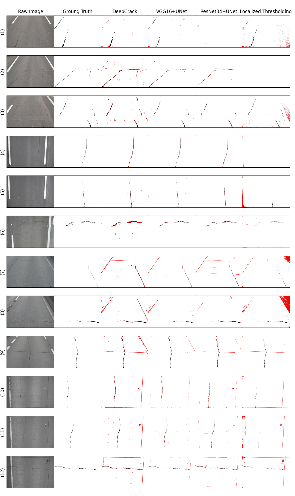

# The NHA12D Dataset 


This reposotries contains dataset published in the paper **NHA12D: A New Pavement Crack Dataset and A Comparison Study of Crack Detection
Algorithms** on [EC3 2022](https://ec-3.org/conference2022/).

**Later the implementation codes will also be shared.**

## Comparison Results
<p align="center">

</p>

## Dataset

This dataset is composed of 80 pavement images, including 40 concrete pavement images and 40
asphalt pavement images, captured by digital survey vehicles on the A12 network in the UK.


## Reference

If you find this code or our dataset helpful in your research, please use the following BibTeX entry.

```
@article{Huang2022NHA, 
   title   = {NHA12D: A New Pavement Crack Dataset and A Comparison Study of Crack Detection Algorithms}, 
   author  = {Zhening Huang, Weiwei Chen, Abir Al-Tabbaa, and Ioannis Brilakis}, 
   journal = {2022 European Conference on Computing in Construction},
   year    = {2022}, 
}
```

## Acknowledgment

The images in the dataset is provided by National Highways.
